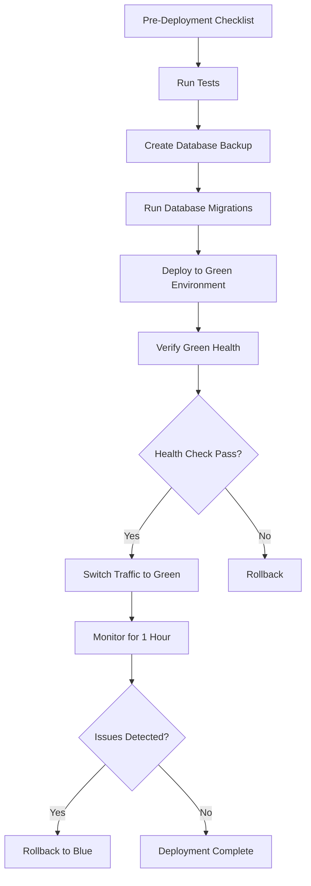
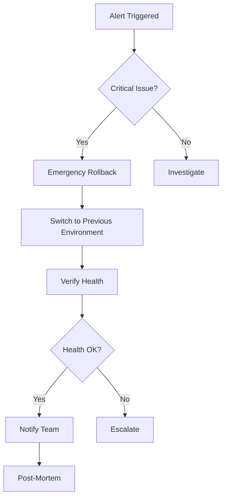

# LLM Observatory Storage Layer - Deployment Documentation Summary

## Overview

This document provides an overview of the complete deployment infrastructure for the LLM Observatory storage layer. All deployment documentation and scripts have been created to support enterprise-grade production deployments.

## Documentation Structure

```
llm-observatory/
├── docs/
│   ├── DEPLOYMENT_RUNBOOK.md          # Comprehensive deployment procedures
│   └── DEPLOYMENT_SUMMARY.md          # This file - overview and quick reference
│
├── scripts/
│   ├── deploy_database.sh             # Database migration deployment
│   ├── deploy_application.sh          # Application deployment
│   ├── verify_deployment.sh           # Post-deployment verification
│   └── rollback.sh                    # Emergency rollback procedures
│
└── docker/
    └── prometheus/
        ├── storage_layer_alerts.yml   # Prometheus alert rules
        ├── alertmanager.yml           # Alertmanager configuration
        └── README.md                  # Monitoring setup guide
```

## Quick Start Guide

### 1. Pre-Deployment Setup

```bash
# Clone repository
cd /workspaces/llm-observatory

# Copy and configure environment variables
cp .env.example .env.production
vim .env.production

# Verify configuration
./scripts/verify_deployment.sh --environment production --dry-run
```

### 2. Database Deployment

```bash
# Run database migrations with safety checks
./scripts/deploy_database.sh \
  --environment production \
  --dry-run

# Review the plan, then execute
./scripts/deploy_database.sh \
  --environment production
```

### 3. Application Deployment

```bash
# Build application
cargo build --release --package llm-observatory-storage

# Deploy using blue-green strategy
./scripts/deploy_application.sh \
  --environment production \
  --version v0.1.0 \
  --strategy blue-green \
  --target green
```

### 4. Verification

```bash
# Run comprehensive verification
./scripts/verify_deployment.sh \
  --environment production \
  --comprehensive

# Monitor for 1 hour
# Check metrics, logs, and alerts
```

### 5. Monitoring Setup

```bash
# Deploy Prometheus and Alertmanager
cd docker/prometheus
# Follow instructions in README.md

# Configure alert routing
vim alertmanager.yml

# Start monitoring stack
docker-compose up -d prometheus alertmanager
```

## Key Features

### Deployment Scripts

#### deploy_database.sh
- **Purpose:** Safe database migration deployment
- **Features:**
  - Automatic backup before migration
  - Retry logic with exponential backoff
  - Transaction-based migrations
  - Schema version tracking
  - Verification after migration
  - Dry-run mode

**Example Usage:**
```bash
# Staging deployment
./scripts/deploy_database.sh --environment staging

# Production with dry-run first
./scripts/deploy_database.sh --environment production --dry-run
./scripts/deploy_database.sh --environment production

# Backup only
./scripts/deploy_database.sh --backup-only

# Specific migration
./scripts/deploy_database.sh --migration 004_continuous_aggregates.sql
```

#### deploy_application.sh
- **Purpose:** Application deployment with multiple strategies
- **Features:**
  - Blue-green deployment
  - Canary deployment
  - Rolling updates
  - Health checks
  - Systemd service management
  - Pre-deployment testing

**Example Usage:**
```bash
# Blue-green deployment
./scripts/deploy_application.sh \
  --environment production \
  --version v0.1.0 \
  --strategy blue-green \
  --target green

# Canary deployment (5% traffic)
./scripts/deploy_application.sh \
  --environment production \
  --version v0.1.0 \
  --strategy canary \
  --canary-percentage 5

# Rolling update
./scripts/deploy_application.sh \
  --environment production \
  --version v0.1.0 \
  --strategy rolling \
  --batch-size 1
```

#### verify_deployment.sh
- **Purpose:** Post-deployment verification
- **Features:**
  - Service health checks
  - Database connectivity tests
  - Schema verification
  - Performance validation
  - Data integrity checks
  - Monitoring verification

**Example Usage:**
```bash
# Basic verification
./scripts/verify_deployment.sh --environment production

# Comprehensive tests
./scripts/verify_deployment.sh \
  --environment production \
  --comprehensive \
  --timeout 600

# Verify specific target
./scripts/verify_deployment.sh \
  --environment production \
  --target green
```

#### rollback.sh
- **Purpose:** Emergency and planned rollback
- **Features:**
  - Blue-green rollback (30 seconds)
  - Application rollback (5 minutes)
  - Database rollback (30+ minutes)
  - Notification integration
  - Confirmation prompts
  - Automatic health checks

**Example Usage:**
```bash
# Emergency rollback (fastest)
./scripts/rollback.sh --emergency --method blue-green

# Planned application rollback
./scripts/rollback.sh \
  --method application \
  --version v0.0.9 \
  --environment production

# Database rollback (CAUTION: DATA LOSS)
./scripts/rollback.sh \
  --method database \
  --backup-file /backups/llm_observatory_20251105.dump \
  --environment production
```

### Monitoring Configuration

#### Prometheus Alert Rules
- **File:** `docker/prometheus/storage_layer_alerts.yml`
- **Categories:**
  - Database availability (7 alerts)
  - Connection pool management (4 alerts)
  - Query performance (3 alerts)
  - Application performance (5 alerts)
  - Database resources (5 alerts)
  - Cache performance (3 alerts)
  - Data integrity (3 alerts)
  - TimescaleDB specific (3 alerts)
  - Backup and recovery (2 alerts)
  - Capacity planning (2 alerts)
  - Security (2 alerts)

**Total:** 39 production-ready alert rules

#### Alertmanager Configuration
- **File:** `docker/prometheus/alertmanager.yml`
- **Features:**
  - Severity-based routing (critical, warning, info)
  - Multiple notification channels (Slack, PagerDuty, Email)
  - Alert grouping and deduplication
  - Inhibition rules
  - Maintenance windows
  - Custom templates

## Deployment Workflows

### Standard Production Deployment



### Emergency Rollback Workflow



## Deployment Environments

### Staging
- **Purpose:** Pre-production testing
- **Configuration:** `.env.staging`
- **Traffic:** Internal only
- **Data:** Subset of production (10-20%)
- **Deployment Frequency:** Multiple times per day

### Production
- **Purpose:** Live customer traffic
- **Configuration:** `.env.production`
- **Traffic:** Customer-facing
- **Data:** Full production dataset
- **Deployment Frequency:** Once per week (planned)

## Security Considerations

### Database Security
- SSL/TLS encryption for connections
- Separate user accounts (app, readonly, admin)
- Password rotation policy
- Connection limits per user
- Query timeout enforcement

### Application Security
- Non-root execution
- Systemd sandboxing
- Secret management via environment variables
- Audit logging enabled
- Rate limiting configured

### Backup Security
- Encrypted backups
- Off-site backup storage
- Backup retention policy (30 days)
- Regular restoration tests
- Access control on backup files

## Monitoring and Alerting

### Alert Severity Levels

| Severity | Response Time | Action | Examples |
|----------|--------------|--------|----------|
| **Critical** | Immediate (page) | Fix now | Database down, service down, backup failed |
| **Warning** | 30 minutes | Investigate soon | High latency, connection pool high, slow queries |
| **Info** | 24 hours | Create ticket | High growth rate, cache hit rate low |

### Key Metrics to Monitor

#### Application Metrics
- Request rate (requests/sec)
- Error rate (%)
- Request duration (P50, P95, P99)
- Active connections

#### Database Metrics
- Connection pool usage (%)
- Query duration (P50, P95, P99)
- Transaction rate (tx/sec)
- Cache hit rate (%)
- Replication lag (seconds)

#### System Metrics
- CPU usage (%)
- Memory usage (%)
- Disk I/O (ops/sec)
- Network I/O (bytes/sec)
- Disk space (%)

## Troubleshooting Quick Reference

### Common Issues

| Issue | Diagnosis | Resolution |
|-------|-----------|------------|
| **Migration Timeout** | Long-running locks | Terminate blocking queries, retry |
| **Connection Pool Exhausted** | Too many active connections | Increase pool size, check for leaks |
| **Slow Queries** | Missing indexes | Create indexes concurrently |
| **High CPU** | Expensive queries | Terminate queries, optimize |
| **Out of Disk** | Database growth | Drop old chunks, expand disk |
| **Service Won't Start** | Configuration error | Check logs, verify DB connection |

### Emergency Contacts

- **On-Call Engineer:** Check PagerDuty rotation
- **Database Team:** #database-team Slack channel
- **Security Team:** security@llm-observatory.io
- **Management Escalation:** See runbook Section 11

## Best Practices

### Before Deployment
1. Review and test in staging first
2. Schedule deployments during low-traffic periods
3. Notify stakeholders of deployment window
4. Ensure on-call engineer is available
5. Have rollback plan ready

### During Deployment
1. Monitor key metrics continuously
2. Watch error logs in real-time
3. Keep communication channels open
4. Document any issues encountered
5. Be ready to rollback if needed

### After Deployment
1. Run comprehensive verification
2. Monitor for at least 1 hour
3. Update deployment documentation
4. Send deployment summary to team
5. Schedule post-deployment review

## Operational Checklists

### Daily (9:00 AM)
- [ ] Check system health dashboard
- [ ] Review error logs (past 24 hours)
- [ ] Verify backup completion
- [ ] Check disk space (>30% free)
- [ ] Review slow query log
- [ ] Monitor connection pool usage

### Weekly (Monday 10:00 AM)
- [ ] Rotate and archive logs
- [ ] Analyze performance metrics
- [ ] Review and update alert thresholds
- [ ] Check for security updates
- [ ] Test backup restoration (sample)
- [ ] Optimize slow queries

### Monthly (First Monday)
- [ ] Capacity planning review
- [ ] Test disaster recovery
- [ ] Security audit
- [ ] Update dependencies
- [ ] Performance benchmarking
- [ ] Team training on new features

## Additional Resources

### Documentation
- **Deployment Runbook:** `/docs/DEPLOYMENT_RUNBOOK.md` (comprehensive guide)
- **Migration Guide:** `/crates/storage/migrations/README.md`
- **Architecture Docs:** `/docs/ARCHITECTURE.md`
- **API Documentation:** Generated with `cargo doc`

### Scripts
- All deployment scripts: `/scripts/`
- Migration scripts: `/crates/storage/migrations/`
- Database utilities: `/crates/storage/scripts/`

### Monitoring
- Prometheus config: `/docker/prometheus/`
- Grafana dashboards: `/docker/grafana/dashboards/`
- Alert runbooks: `https://docs.llm-observatory.io/runbooks/`

### External Links
- [TimescaleDB Documentation](https://docs.timescale.com/)
- [PostgreSQL Documentation](https://www.postgresql.org/docs/)
- [Prometheus Documentation](https://prometheus.io/docs/)
- [Rust Deployment Guide](https://doc.rust-lang.org/cargo/guide/)

## Versioning and Updates

### Current Version
- **Storage Layer:** v0.1.0
- **Database Schema:** v6.0
- **Deployment Scripts:** v1.0.0
- **Alert Rules:** v1.0.0

### Update Procedures
- **Patch Updates:** Can be deployed any time
- **Minor Updates:** Deploy during scheduled window
- **Major Updates:** Require planning and stakeholder approval

### Changelog
See `CHANGELOG.md` for detailed version history.

## Support

### Getting Help
- **Documentation:** Start with this guide and the deployment runbook
- **Team Chat:** #llm-observatory-support Slack channel
- **Email:** support@llm-observatory.io
- **On-Call:** Page via PagerDuty for critical issues

### Reporting Issues
- **Bugs:** Create issue in GitHub repository
- **Security:** Email security@llm-observatory.io
- **Feature Requests:** Discuss in #llm-observatory-ideas

---

**Document Version:** 1.0
**Last Updated:** 2025-11-05
**Maintained By:** LLM Observatory Team
**Next Review:** 2025-12-05
